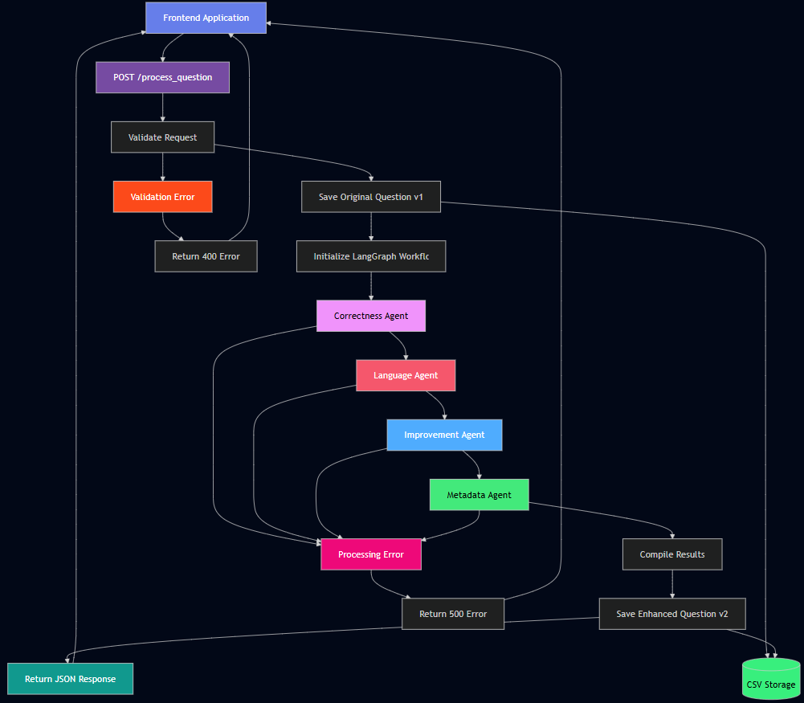

# AI QC + Enhancement Bot for Question Banks

This backend system is a FastAPI application designed to process and enhance educational questions (MCQs, short-answer, etc.) using a sophisticated AI pipeline. The system leverages Google's Gemini  LLM, orchestrated by LangGraph, to perform a series of quality control checks, improvements, and metadata extractions. All processing is versioned, creating a complete history for each question.

## Core Technologies

- **FastAPI**: For building the robust and fast API endpoints.
- **LangChain & LangGraph**: For creating and managing the multi-agent AI workflow.
- **Google Gemini Pro**: The underlying Large Language Model for all AI tasks.
- **Uvicorn**: As the ASGI server to run the FastAPI application.
- **Pydantic**: For data validation and settings management.

## System Architecture

The application is built around a central FastAPI server that exposes several endpoints to a frontend client. When a question is submitted, it is passed to a LangGraph-defined workflow, which processes the question through a series of specialized AI "agents." The results, along with the original question and the improved version, are saved to a CSV file for persistent version history.

### Detailed Workflow and Diagram

The entire process is designed to be robust, versioned, and transparent. Below is a visual representation of the data flow from client request to final response, followed by a detailed step-by-step breakdown.



#### Step-by-Step Breakdown

1.  **Client Request**: A user submits a question through the frontend application. This triggers an HTTP `POST` request to the `/process_question/` endpoint on the FastAPI server, containing the `question_text` and `created_by` information.

2.  **Initial Versioning**: The `main.py` endpoint immediately captures the original question. It calls the `append_question_version` utility to save this initial submission as **Version 1** in the `question_versions.csv` file. This ensures the original, untouched question is always preserved.

3.  **LangGraph Invocation**: The API then invokes the compiled LangGraph `app` from `langgraph_flow.py`, passing the original question text into the initial state of the graph.

4.  **Agent Execution (Sequential)**: The LangGraph workflow begins executing the agents in a predefined sequence. The state (which includes the question text and feedback dictionaries) is passed from one node to the next.

    - **Correctness Agent**: First, it evaluates the question for factual and logical errors.
    - **Language Agent**: Second, it checks the same question for grammar and style issues.
    - **Improvement Agent**: Third, it takes the original question and attempts to improve it, correcting any identified errors and enhancing clarity. The `question_text` in the state is now updated to this new, improved version.
    - **Metadata Agent**: Finally, it analyzes the **improved question text** to extract metadata like topic, difficulty, etc.

5.  **Final State**: Once the last agent (`metadata`) completes, the graph execution ends. The final state, now populated with feedback from all four agents and the improved question text, is returned to the `main.py` endpoint.

6.  **Final Versioning**: The API calls `append_question_version` again. This time, it saves **Version 2**, which includes the original text, the improved text, and all the structured feedback (correctness, language, improvement, and metadata) gathered during the workflow.

7.  **HTTP Response**: The server constructs a final JSON response containing the `question_id`, the latest `version_number`, the original and processed questions, and the full version history. This is sent back to the client, which can then display the results to the user.

## LangGraph AI Workflow

The heart of the system is a sequential, stateful graph defined in `langgraph_flow.py`. This graph ensures that the question is processed in a logical order, with the output of one step potentially influencing the next.

The state of the graph at any point includes the question text, feedback from all agents, and any errors encountered.

### The Agents

The workflow consists of four distinct agents, each with a specific role:

1.  **Correctness Agent** (`correctness_agent.py`)

    - **Purpose**: Acts as a factual and logical verifier. It checks if the question is accurate, logically sound, and structurally correct (e.g., an MCQ has one clear answer).
    - **Prompt**: `correctness_prompt.txt` strictly instructs the model to ignore grammar and style and focus only on correctness.
    - **Output**: A JSON object with `is_correct`, a list of `errors`, and an `explanation`.

2.  **Language Agent** (`language_agent.py`)

    - **Purpose**: Functions as a proofreader and style editor. It checks for grammatical errors, punctuation issues, lack of clarity, and ambiguity.
    - **Prompt**: `language_prompt.txt` guides the model to focus on the quality of the writing.
    - **Output**: A JSON object with `issues_found`, a list of `feedback`, and an `explanation`.

3.  **Improvement Agent** (`improvement_agent.py`)

    - **Purpose**: This is the most transformative agent. It rewrites the question to be clearer, more precise, and pedagogically effective, correcting any factual errors found by the correctness agent.
    - **Prompt**: `improvement_prompt.txt` provides a detailed methodology, emphasizing the preservation of the original pedagogical intent.
    - **Output**: A JSON object with the `improved_question` and a `justification` for the changes. The `improved_question` from this agent is passed to the metadata agent.

4.  **Metadata Agent** (`metadata_agent.py`)
    - **Purpose**: Analyzes the _improved_ question to extract relevant educational metadata.
    - **Prompt**: `metadata_prompt.txt` asks the model to identify the topic, subtopic, Bloom's Taxonomy level, and difficulty.
    - **Output**: A JSON object containing the extracted metadata fields.

## API Endpoints

The application exposes the following endpoints, defined in `main.py`:

#### `POST /process_question/`

- **Summary**: The main endpoint to submit a question for processing.
- **Request Body**:
  ```json
  {
    "question_text": "Your question here...",
    "created_by": "User's Name"
  }
  ```
- **Response Body**: A `ProcessQuestionResponse` object containing the `question_id`, the final `version_number`, the `original_question`, the `processed_question`, and a complete `version_history`.

#### `GET /questions/{question_id}/versions`

- **Summary**: Retrieves all stored versions for a given question ID.
- **Response Body**: A list of `QuestionVersion` objects.

#### `GET /download-csv`

- **Summary**: Downloads the entire `question_versions.csv` file, providing a raw data dump of all processed questions.

## Versioning System

The versioning logic is handled by functions in `utils.py` and the data is stored in `question_versions.csv`.

- **Initialization**: The `initialize_csv()` function ensures the CSV file exists and has the correct headers.
- **Appending Versions**: The `append_question_version()` function writes a new row to the CSV for each version, capturing the state of the question and all associated feedback at that point.
- **Versioning Scheme**:
  - The first version of any question is always the original, user-submitted text.
  - The second version is the AI-processed output, which includes the improved text and all feedback.
  - Future versions could accommodate manual edits or re-processing.

## How to Run the Application

1.  **Install Dependencies**:

    ```bash
    pip install -r requirements.txt
    ```

2.  **Set Up Environment Variables**:
    Create a `.env` file in the `mathongo-ai-qc` directory and add your Gemini API key:

    ```
    GEMINI_API_KEY="YOUR_API_KEY"
    ```

3.  **Start the Server**:
    ```bash
    uvicorn main:app --reload
    ```
    The application will be available at `http://127.0.0.1:8000`.
