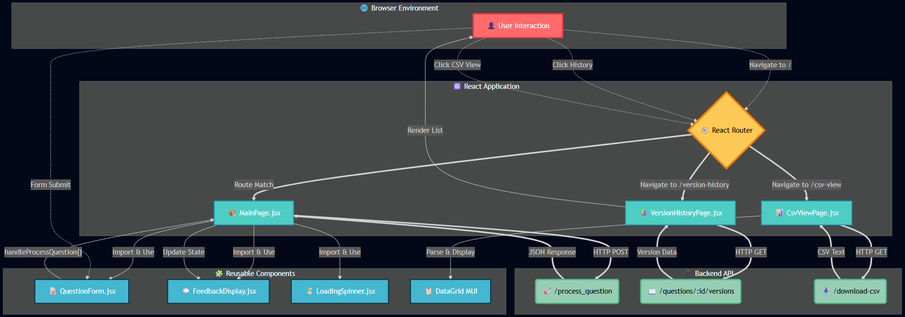

# AI QC Bot Frontend

This directory contains the React-based frontend for the AI QC + Enhancement Bot. It is a modern, single-page application (SPA) built with Vite, providing a user-friendly interface to interact with the backend, submit questions, and view the processed results and version histories.

## Core Technologies

- **React**: For building the user interface components.
- **Vite**: As the build tool and development server.
- **React Router**: For handling client-side routing and navigation.
- **Material-UI (MUI)**: Used for sophisticated UI components like the `DataGrid`.
- **Papaparse**: For parsing CSV data directly in the browser.
- **ESLint**: For code linting and maintaining code quality.

## Application Structure

The application is organized into a clear and maintainable structure, separating pages, components, hooks, and styles.

- `src/pages`: Contains the top-level components for each route (e.g., `MainPage`, `VersionHistoryPage`).
- `src/components`: Contains reusable UI components used across different pages (e.g., `QuestionForm`, `FeedbackDisplay`).
- `src/hooks`: Contains custom React hooks that encapsulate business logic (e.g., `useQuestionProcessor`).
- `src/api.js`: A dedicated file for handling API calls to the backend.
- `src/styles`: Contains global and component-specific CSS files.

### Data Flow and Component Architecture

The application follows a logical data flow, with state management and API interactions handled at the page level or within custom hooks, and then passed down to presentational components.



## Key Components and Pages

### Pages

1.  **`MainPage.jsx` (`/`)**

    - **Purpose**: This is the main entry point of the application. It allows users to submit a new question for processing.
    - **Logic**: It utilizes the `useQuestionProcessor` custom hook to manage the entire lifecycle of a question submission, including making the API call and handling loading, error, and success states.
    - **UI**: Composed of the `QuestionForm` for input and the `FeedbackDisplay` to show the results from the backend. It also includes buttons to navigate to the full CSV view and the version history for the last processed question.

2.  **`VersionHistoryPage.jsx` (`/version-history/:questionId`)**

    - **Purpose**: Displays a detailed, version-by-version history for a specific question.
    - **Logic**: It extracts the `questionId` from the URL, calls the `/questions/:questionId/versions` API endpoint, and displays the fetched data.
    - **UI**: Renders a collapsible table where each row represents a version. Users can expand a row to see the full question text and the detailed JSON feedback from each AI agent.

3.  **`CsvViewPage.jsx` (`/csv-view`)**
    - **Purpose**: Provides a raw, tabular view of the entire `question_versions.csv` file.
    - **Logic**: It fetches the CSV data from the `/download-csv` endpoint, parses it using Papaparse, and formats it for display.
    - **UI**: Uses the powerful `DataGrid` component from Material-UI to render the data in a sortable, filterable, and paginated table, making it easy to explore the raw data.

### Reusable Components

- **`QuestionForm.jsx`**: A simple form with a text area for the question and a submit button. It is a controlled component that passes the submission event up to its parent.
- **`FeedbackDisplay.jsx`**: A crucial component for visualizing the complex feedback from the backend. It neatly organizes the correctness, language, improvement, and metadata feedback into distinct sections.
- **`LoadingSpinner.jsx`**: A simple CSS-based spinner to provide visual feedback to the user during asynchronous operations.

## How to Run the Application

1.  **Navigate to the Frontend Directory**:

    ```bash
    cd frontend-react
    ```

2.  **Install Dependencies**:

    ```bash
    npm install
    ```

3.  **Start the Development Server**:
    ```bash
    npm run dev
    ```
    The application will be available at `http://localhost:5173` by default (or another port if 5173 is in use). The Vite server will automatically proxy requests to the backend if configured, or you can run the backend separately.
