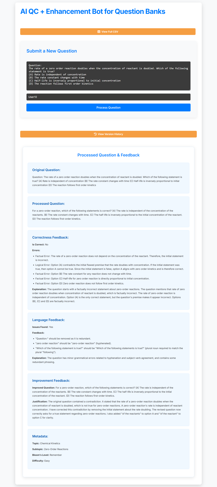
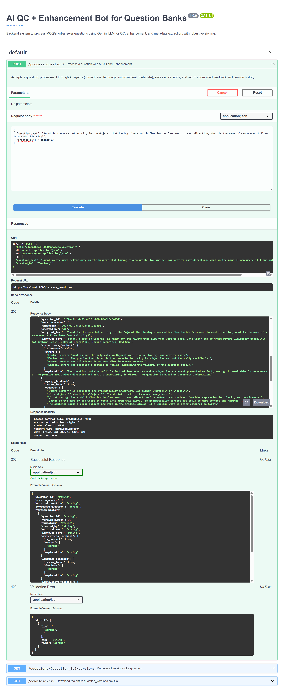
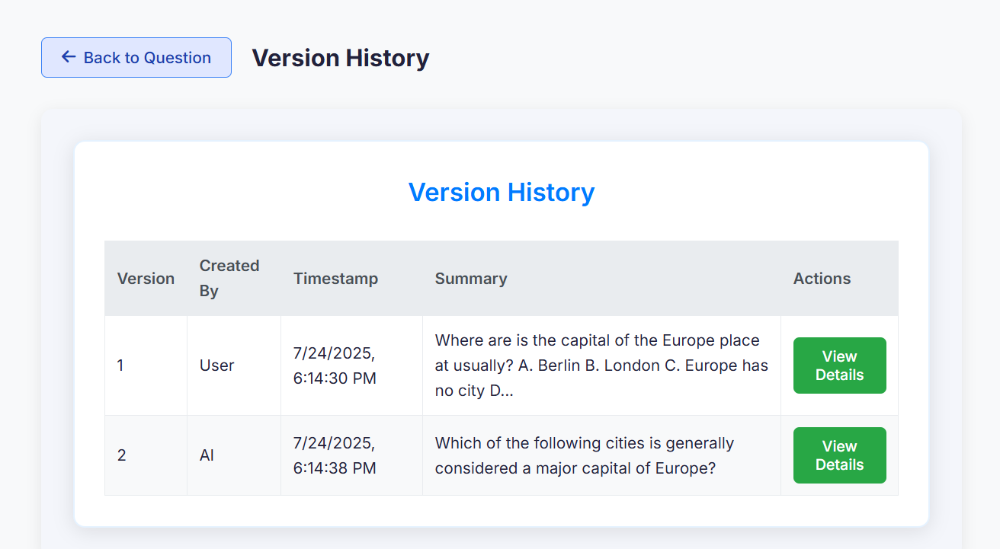
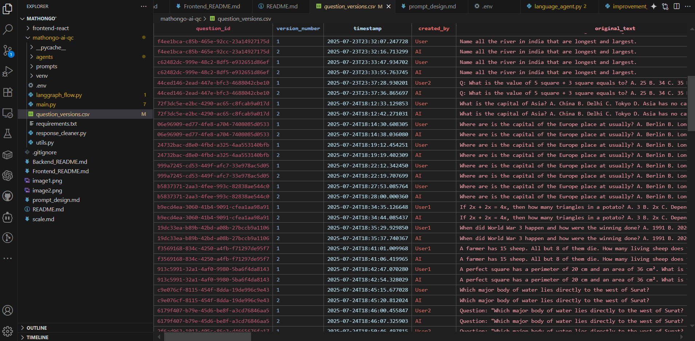

# AI QC + Enhancement Bot

This project is a full-stack application designed to improve the quality of educational question banks using a sophisticated AI pipeline. It consists of a React-based frontend and a Python FastAPI backend that leverages Google's Gemini via LangGraph to perform quality control, enhancement, and metadata extraction on submitted questions.







## Project Structure

The repository is organized into two main directories:

- `frontend-react/`: Contains the modern, single-page application (SPA) that provides the user interface for interacting with the system.
- `mathongo-ai-qc/`: Contains the robust FastAPI backend that orchestrates the multi-agent AI workflow.
  
  

## Architecture Overview

The system is designed with a clear separation of concerns between the frontend and backend.

### Backend (`mathongo-ai-qc`)

The backend is a FastAPI application that exposes a set of API endpoints to process questions. When a question is submitted, it is passed through a **LangGraph-defined workflow** consisting of four specialized AI agents:

1.  **Correctness Agent**: Verifies factual and logical accuracy.
2.  **Language Agent**: Checks for grammar, style, and clarity.
3.  **Improvement Agent**: Rewrites the question for better quality.
4.  **Metadata Agent**: Extracts educational metadata (e.g., topic, difficulty) from the improved question.

All processing is versioned and stored in a CSV file, creating a complete history for each question.

For more details, see the [Backend README](Backend_README.md).

### Frontend (`frontend-react`)

The frontend is a responsive React application built with Vite. It provides a user-friendly interface for:

- Submitting new questions for processing.
- Viewing the AI-generated feedback and the improved question text.
- Exploring the complete version history for any question.
- Viewing the raw data in a filterable, sortable data grid.

For more details, see the [Frontend README](Frontend_README.md).

## How to Run the Full Application

To run the entire application, you need to start both the backend server and the frontend development server.

### 1. Run the Backend

First, set up and run the FastAPI server.

```bash
# Navigate to the backend directory
cd mathongo-ai-qc

# Install dependencies
pip install -r requirements.txt

# Create a .env file and add your Gemini API key
# echo 'GEMINI_API_KEY="YOUR_API_KEY"' > .env

# Start the server
uvicorn main:app --reload
```

The backend will be running at `http://127.0.0.1:8000`.

### 2. Run the Frontend

In a separate terminal, set up and run the React application.

```bash
# Navigate to the frontend directory
cd frontend-react

# Install dependencies
npm install

# Start the development server
npm run dev
```

The frontend will be available at `http://localhost:5173` (or another port if 5173 is in use). The application is configured to proxy API requests to the backend.

You can now open your browser to `http://localhost:5173` to use the AI QC Bot.
